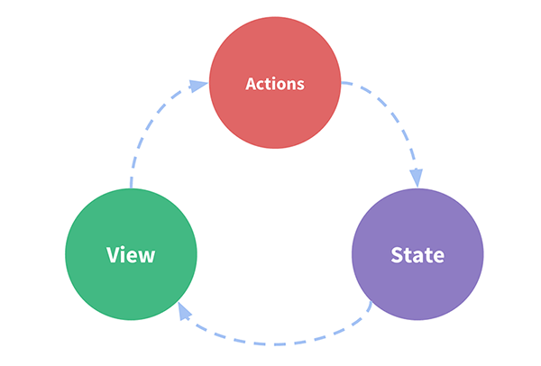

# Vuejs

## 문법 정리

# Vuex
* actions, mutations를 사용해야함

<br><br>
## basic
* ... 같은 es6 문법의 확장 연산자(spread operator)를 사용하려면, Babel stage-2 이상의 라이브러리 설치 및 babel preset 에 추가가 필요하다.
```javascript
// .babelrc
{
  "presets": [
    ["env", { "modules": false }],
    "stage-3"
  ]
}
```
* https://babeljs.io/docs/en/babel-preset-stage-2/
<br><br>
## state
* https://joshua1988.github.io/web-development/vuejs/vuex-start/
<br><br>
## getters, mutations
* https://joshua1988.github.io/web-development/vuejs/vuex-getters-mutations/
### getters
* computed와 같은 개념으로, state를 직접 변경하는 것이 아닌 state를 활용하여 계산할때 이용
```javascript
// getters.js
const getters = {
    getValue(state) {
        return !!state.value
        // 또는
        return state.value * 2
    }
}
```
### mutations
* state를 변경할 수 있음
* 동기 로직일 경우 사용
* computed가 아닌 methods에서 선언
<br><br>
## actions
* 비동기 로직에 사용
* https://joshua1988.github.io/web-development/vuejs/vuex-actions-modules/
